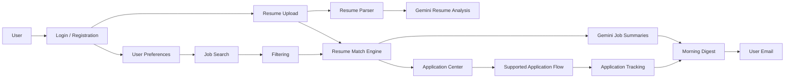

# 🌅 Morning Job Agent

### Autonomous AI Job Search, Resume Matching & Application Assistant

**Morning Job Agent** is a multi-user AI job-search platform built with Streamlit, LangGraph, Google Gemini, Python, SQLite, and Playwright.

It lets each user create an account, upload a resume, build an AI-readable profile, define job preferences, discover relevant jobs, calculate explainable resume-to-job matches, track applications, and receive personalized email digests.

<br>

**Search → Analyze Resume → Match → Summarize → Track → Apply on Supported Flows → Email**

</div>

---

## ✨ Key Features

### 🔐 Multi-user accounts
- User registration and login.
- Passwords are stored as salted PBKDF2 hashes.
- Each account has its own resume, profile, preferences, and application history.

### 📄 Resume intelligence
- Upload PDF or DOCX resumes.
- Extract resume text locally.
- Use Google Gemini to build a structured `ResumeProfile`.
- Preserve only information supported by the uploaded resume.

### 🎯 Explainable job matching
The matching layer compares the job with the user's resume and preferences using explicit signals such as:
- Role fit
- Skill overlap
- Location fit
- Experience information

The UI shows the match percentage, matched skills, missing skills, and an explanation.

### 🔎 Job discovery
The project includes a RemoteOK integration and an extensible job-source structure for additional sources.

### 🤖 AI job summaries
Gemini can generate:
- Role summary
- Required skills
- Technologies
- Experience level
- Interview preparation tips

### 🚀 Application Center
The application workflow can track:
- Ready
- Submitted
- Failed
- Blocked
- Manual action required

Browser automation is limited to supported HTTPS application flows. CAPTCHA, MFA, OTP, and unrecognized forms stop automation instead of being bypassed.

### 📧 Personalized email digest
Each authenticated user receives the digest at the email address associated with their account.

### ⏰ Scheduling
The application includes manual, daily, and hourly execution controls.

> For production-grade unattended scheduling, run the automation worker as a separate scheduled process (for example, cron, Windows Task Scheduler, GitHub Actions, or a cloud scheduler) rather than relying on a browser tab remaining open.

### 🌌 Premium UI
The Streamlit dashboard uses:
- Dark glassmorphism styling
- Aurora-style background effects
- Gradient controls
- Resume/profile panel
- Application Center
- Saved job analytics

---

## 🧠 How the System Works



---

## 🏗️ Project Architecture

```text
Morning-Job-Agent/
│
├── app.py
├── config.py
├── requirements.txt
├── README.md
├── .env.example
├── .gitignore
│
├── agents/
│   ├── __init__.py
│   ├── workflow.py
│   ├── search_agent.py
│   ├── job_agent.py
│   ├── filter_agent.py
│   ├── summarizer_agent.py
│   ├── resume_agent.py
│   ├── matching_agent.py
│   ├── application_agent.py
│   └── outreach_agent.py
│
├── automation/
│   ├── __init__.py
│   ├── daily_job.py
│   └── auto_apply.py
│
├── database/
│   ├── __init__.py
│   ├── database.py
│   ├── user_preferences.py
│   ├── resume_storage.py
│   ├── application_storage.py
│   └── users.db                 # Local runtime data; do not commit
│
├── models/
│   ├── __init__.py
│   ├── schemas.py
│   └── agent_models.py
│
├── services/
│   ├── __init__.py
│   ├── remoteok.py
│   ├── email_service.py
│   ├── scheduler.py
│   ├── browser_service.py
│   ├── resume_parser.py
│   └── matching_service.py
│
│   └── job_sources/
│       ├── __init__.py
│       ├── remoteok_source.py
│       ├── linkedin.py
│       ├── indeed.py
│       └── naukri.py
│
├── uploads/
│   └── resumes/                 # User resume files; do not commit
│
├── data/
│   ├── jobs.csv                 # Local generated job data
│   └── applications.csv         # Local generated application data
│
├── assets/
│   └── logo.png
│
├── tests/
│   ├── __init__.py
│   ├── test_scraper.py
│   ├── test_matching.py
│   ├── test_resume_parser.py
│   └── test_application_service.py
│
└── utils/
    ├── __init__.py
    ├── logger.py
    └── helpers.py
```

---

## 🔄 Agent Workflow

The main workflow is designed as a reusable pipeline rather than putting all logic directly inside the UI.

```text
1. Search
   ↓
2. Normalize job records
   ↓
3. Filter against user preferences
   ↓
4. Match jobs against resume profile
   ↓
5. Generate AI summaries
   ↓
6. Save results
   ↓
7. Queue eligible applications
   ↓
8. Record application status
   ↓
9. Build personalized email digest
```

The Streamlit application presents and controls this workflow; it is not the only execution path.

---

## 📄 Resume Processing

Supported files:

```text
.pdf
.docx
```

The resume pipeline is:

```text
Uploaded file
    ↓
Resume parser
    ↓
Plain text
    ↓
Gemini analysis
    ↓
ResumeProfile
    ↓
Stored per user
```

The structured profile can contain fields such as:

```text
Full name
Email
Phone
Education
Years of experience
Skills
Technologies
Cloud skills
Target roles
Projects
Certifications
```

The application is designed not to invent resume facts when building the profile.

---

## 🎯 Matching Logic

The matching engine is intentionally explainable.

A match result contains information such as:

```text
match_score
role_score
skill_score
location_score
experience_score
matched_skills
missing_skills
role_fit
location_fit
explanation
```

The result is then shown in the **Resume Match Analysis** section of the dashboard.

This makes the match easier to inspect than an unexplained black-box score.

---

## 🚀 Application Automation

The Application Center supports an explicit auto-apply setting.

Typical flow:

```text
Eligible job
    ↓
Match score meets user's threshold
    ↓
Supported application host
    ↓
Open application page
    ↓
Fill supported fields
    ↓
Upload resume
    ↓
Submit when the form is recognized
    ↓
Verify visible confirmation
    ↓
Record final status
```

### Safety behavior

The automation should stop and record a non-success status when:
- The site is not allowlisted.
- The application form is not recognized.
- CAPTCHA is present.
- MFA or OTP is required.
- The page requires a manual action.
- Submission cannot be verified.

The system should never report an application as `SUBMITTED` without a successful submission/confirmation condition.

---

## 👤 Per-user Data

Each user has independent information:

```text
User account
    ├── Email
    ├── Resume
    ├── AI Resume Profile
    ├── Target Roles
    ├── Skills
    ├── Locations
    ├── Minimum Match Score
    ├── Auto-apply setting
    ├── Digest setting
    └── Application History
```

The email digest recipient comes from the authenticated user's account.

---

## 📦 Installation

### 1. Clone the repository

```bash
git clone https://github.com/YOUR_USERNAME/Morning-Job-Agent.git
cd Morning-Job-Agent
```

### 2. Create a virtual environment

#### Windows PowerShell

```powershell
python -m venv venv
.\venv\Scripts\Activate.ps1
```

#### macOS / Linux

```bash
python3 -m venv venv
source venv/bin/activate
```

### 3. Install dependencies

```bash
python -m pip install -r requirements.txt
```

### 4. Install the Playwright browser

```bash
python -m playwright install chromium
```

### 5. Configure environment variables

Copy:

```text
.env.example
```

to:

```text
.env
```

Then add your own credentials.

### 6. Start the application

```bash
streamlit run app.py
```

Open the local Streamlit address shown in the terminal.

---

## 🔑 Environment Variables

Example:

```env
# Gemini
GEMINI_API_KEY=
GEMINI_MODEL=

# Gmail SMTP sender
SMTP_HOST=smtp.gmail.com
SMTP_PORT=587
SMTP_USER=
SMTP_PASSWORD=
SMTP_USE_TLS=true

# Optional legacy compatibility value
EMAIL_RECIPIENT=

# RemoteOK
REMOTEOK_URL=https://remoteok.com/api
REQUEST_TIMEOUT_SECONDS=15
MAX_JOBS_PER_RUN=40

# Scheduler
SCHEDULER_HOUR=8
SCHEDULER_MINUTE=0

# Logging
LOG_LEVEL=INFO
```

### Notes

`SMTP_USER` and `SMTP_PASSWORD` are for the sending account.

The actual recipient for a user's digest should come from that user's logged-in account.

Never commit `.env`.

---

## 🔒 Security

Never commit:

```text
.env
database/users.db
data/jobs.csv
data/applications.csv
uploads/resumes/
logs/
```

The repository's `.gitignore` is intended to keep local credentials and runtime/user data out of Git.

If an API key or email credential is accidentally exposed:
1. Revoke it.
2. Create a replacement.
3. Update `.env`.
4. Check Git history before publishing the repository.

Do not place production secrets directly in Python source files.

---

## 🧪 Testing

Run all tests:

```bash
python -m pytest
```

Verbose mode:

```bash
python -m pytest -v
```

Targeted tests:

```bash
python -m pytest tests/test_scraper.py -v
python -m pytest tests/test_resume_parser.py -v
python -m pytest tests/test_matching.py -v
python -m pytest tests/test_application_service.py -v
```

The test suite covers the major local components, including:
- Job-source normalization
- Network/error handling
- Resume parsing
- Matching behavior
- Application service behavior

---

## 🖥️ Local Development

A useful development sequence is:

```text
1. Start Streamlit
2. Create/login to an account
3. Upload the resume
4. Analyze the resume
5. Save job preferences
6. Run the agent
7. Review Resume Match Analysis
8. Review Application Center
9. Test email delivery
10. Run the automated worker separately when scheduling is required
```

---

## 📧 Email Digest

The dashboard contains an **Email My Digest** action.

A scheduled digest can be generated from the same workflow.

The message can contain:
- Matched role
- Company
- Location
- Salary information when available
- AI-generated summary
- Job link

SMTP is optional. If SMTP is not configured, the rest of the application can continue running without email delivery.

---

## 🗃️ Local Persistence

The application uses local storage for development:

```text
database/users.db
data/jobs.csv
data/applications.csv
uploads/resumes/
```

These files are runtime/user data and should not be pushed to GitHub.

For a production deployment, consider moving persistent data to a managed database and object storage.

---

## 🌐 Deployment

The Streamlit interface can be deployed to a hosting service that supports Python and Streamlit.

Typical requirements:

```text
Install requirements
Set environment variables / secrets
Start Streamlit
Provide persistent storage when user data must survive redeployments
```

### Important production consideration

The Streamlit process and the scheduled automation worker are separate concerns.

For reliable unattended job runs, use a persistent scheduler/worker such as:
- Linux cron
- Windows Task Scheduler
- GitHub Actions
- Cloud Scheduler + a worker/service
- Another managed job scheduler

If the deployment platform uses ephemeral storage, local SQLite/CSV/resume files may not persist across restarts. Use managed persistent storage for production accounts.

---

## 🧩 Extending the Project

### Add another job source

Implement a new adapter under:

```text
services/job_sources/
```

Then normalize the result into the project's job schema.

### Add another AI agent

Create a module under:

```text
agents/
```

and connect it to the workflow when appropriate.

### Add another application provider

Extend the supported application logic in:

```text
services/application_service.py
services/browser_service.py
agents/application_agent.py
```

Keep site-specific rules isolated and preserve explicit failure states.

---

## 📊 Dashboard Sections

The current dashboard includes:

```text
🌅 Morning Job Agent
├── Job Preferences
├── Scheduler
├── My Account
├── Resume & AI Profile
├── Personal Job Preferences & Automation
├── Run Agent Now
├── Email My Digest
├── Resume Match Analysis
├── Application Center
└── Saved Jobs
```

---

## 🛠️ Troubleshooting

### Gemini authentication/model error

Check:
- `GEMINI_API_KEY`
- `GEMINI_MODEL`
- Installed `google-genai` package
- Whether the configured model is available to your API project

Restart Streamlit after changing `.env`:

```bash
streamlit run app.py
```

### PDF/DOCX import error

Install:

```bash
python -m pip install pypdf python-docx
```

### Playwright error

Install:

```bash
python -m pip install playwright
python -m playwright install chromium
```

### Old resume/profile data

Runtime data lives under:

```text
database/
data/
uploads/
```

Deleting those runtime files resets local data, but do not delete your Python source code.

---

## 🗺️ Roadmap

- [ ] Expand supported job sources
- [ ] Production database support
- [ ] Persistent object storage for resumes
- [ ] More ATS/application-flow adapters
- [ ] Better application form field mapping
- [ ] Resume tailoring for individual jobs
- [ ] Analytics for applications and outcomes
- [ ] Additional notification channels
- [ ] Vector/semantic search across saved jobs and resumes

---

## 📄 License

MIT License.

See `LICENSE` for the complete license text.

---

<div align="center">

### Built with ❤️ using Python, Streamlit, LangGraph, Gemini, SQLite and Playwright

**Find roles. Understand them. Match them. Track them.**

</div>
